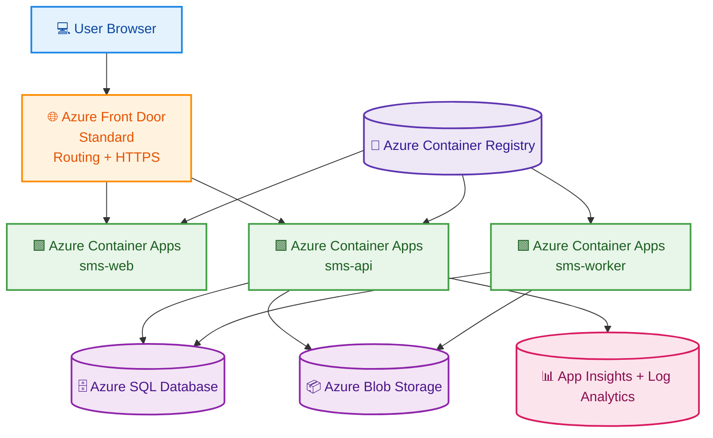
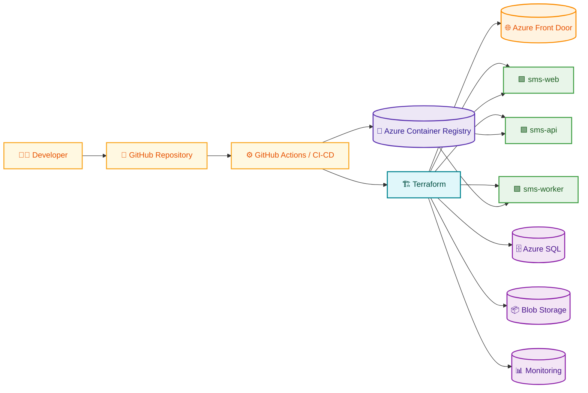

<div align="center">

# 🎓 School Management System (SMS)

### ☁️ Azure-native • 🏗️ Terraform-driven • 🚀 Cloud-native • 📚 Portfolio-ready


</div>

---

☁️ A cloud-native School Management System built on **Microsoft Azure** using **Terraform**, **Azure Container Apps**, **Azure SQL Database**, **Azure Storage**, and **Azure Front Door**.

This project is designed as:
- 📌 a GitHub portfolio showcase,
- 🏗️ an Azure-native reference architecture,
- 🚀 a fully deployable infrastructure + application solution,
- 📚 a documentation-rich enterprise-style demo.

---

## 🔎 At a Glance

- **Frontend:** Next.js
- **Backend:** .NET 8 Web API
- **Worker:** .NET Worker Service
- **Runtime:** Azure Container Apps
- **Database:** Azure SQL Database
- **Storage:** Azure Blob Storage
- **Edge:** Azure Front Door Standard
- **IaC:** Terraform

---

## ✨ Project Highlights

- 🏗️ **Infrastructure as Code** with Terraform
- 🖥️ **Frontend** built with Next.js
- 🔧 **Backend API** built with .NET 8 Web API
- ⚙️ **Background Worker** built with .NET Worker Service
- 🔐 **Authentication** using custom JWT
- ☁️ **Runtime** on Azure Container Apps
- 🗄️ **Database** on Azure SQL Database
- 📦 **Document Storage** on Azure Blob Storage
- 📊 **Monitoring** with Application Insights and Log Analytics
- 🌐 **Edge Routing** with Azure Front Door Standard

---

## 🧭 Architecture Summary

The solution consists of:
- 🟩 **sms-web** → frontend web application
- 🟥 **sms-api** → backend API
- 🟪 **sms-worker** → background worker (optional in current MVP)

Requests flow through **Azure Front Door**, which routes traffic to the web app and API.  
The API integrates with **Azure SQL Database**, **Azure Blob Storage**, and **Azure monitoring services**.  
Container images are stored in **Azure Container Registry** and deployed to **Azure Container Apps**.

---

## 🏛️ Architecture Diagrams

### Runtime Architecture


### Deployment Flow


---

## 🔑 Demo Credentials

| Role | Email | Password |
|------|-------|----------|
| Super Admin | admin@schoolsms.com | Admin@123 |
| Teacher | teacher@schoolsms.com | Teacher@123 |
| Student | student@schoolsms.com | Student@123 |

---

## 🚀 Quick Start

### 1️⃣ Clone the repository
```bash
git clone https://github.com/yourusername/School-Management-System-SMS.git
cd School-Management-System-SMS
```

### 2️⃣ Deploy infrastructure
```bash
cd infra
terraform init
terraform plan
terraform apply
```

### 3️⃣ Build and push application images
Use Azure Container Registry remote build:
```bash
cd ../apps/api
az acr build --registry <acr-name> --image sms-api:v1 .

cd ../web
az acr build --registry <acr-name> --image sms-web:v1 .

cd ..
az acr build --registry <acr-name> --image sms-worker:v1 --file worker/Dockerfile .
```

### 4️⃣ Update Azure Container Apps
```bash
az containerapp update --name ca-sms-api-dev --resource-group rg-sms-dev --image <acr>.azurecr.io/sms-api:v1
az containerapp update --name ca-sms-web-dev --resource-group rg-sms-dev --image <acr>.azurecr.io/sms-web:v1
az containerapp update --name ca-sms-worker-dev --resource-group rg-sms-dev --image <acr>.azurecr.io/sms-worker:v1
```

### 5️⃣ Validate
- 🌍 Open the web URL
- 🔐 Log in with demo credentials
- ❤️ Check API health endpoint

For full instructions, see the [Deployment Guide](./docs/05-DEPLOYMENT.md).

---

## 📘 Documentation

All documentation is located in the [`docs/`](./docs) folder.

### 📂 Core Documents
- [🏠 Documentation Home](./docs/INDEX.md)
- [🎯 Objectives](./docs/00-OBJECTIVES.md)
- [🗂️ Project Structure](./docs/01-STRUCTURE.md)
- [🏛️ Architecture Overview](./docs/02-ARCHITECTURE.md)
- [📐 High-Level Design (HLD)](./docs/03-HLD.md)
- [🧩 Low-Level Design (LLD)](./docs/04-LLD.md)
- [🚀 Deployment Guide](./docs/05-DEPLOYMENT.md)
- [🔐 Security Guide](./docs/06-SECURITY.md)
- [🛠️ Runbook](./docs/07-RUNBOOK.md)
- [👥 RBAC Matrix](./docs/08-RBAC-MATRIX.md)
- [🗄️ Data Model](./docs/09-DATA-MODEL.md)
- [🧯 Troubleshooting](./docs/10-TROUBLESHOOTING.md)
- [⚠️ Known Issues](./docs/11-KNOWN-ISSUES.md)
- [🛣️ Roadmap](./docs/12-ROADMAP.md)
- [🔄 Deployment Flow Diagram](./docs/13-DEPLOYMENT-FLOW-DIAGRAM.md)

### 🏗️ Architecture Decision Records
- [ADR-001: Container Apps vs AKS](./docs/adr/ADR-001-Container-Apps-vs-AKS.md)
- [ADR-002: Custom JWT vs Entra ID](./docs/adr/ADR-002-Custom-JWT-vs-Entra-ID.md)
- [ADR-003: Azure Front Door Standard vs Premium](./docs/adr/ADR-003-Azure-Front-Door-Standard-vs-Premium.md)
- [ADR-004: Azure SQL vs PostgreSQL](./docs/adr/ADR-004-Azure-SQL-vs-PostgreSQL.md)
- [ADR-005: Application Decomposition (Web/API/Worker)](./docs/adr/ADR-005-Application-Decomposition-Web-API-Worker.md)

---

## 🗃️ Project Structure

```text
School-Management-System-SMS/
├── README.md
├── docs/
├── infra/
├── apps/
│   ├── api/
│   ├── web/
│   └── worker/
├── scripts/
└── .github/
```

For more details, see [Project Structure](./docs/01-STRUCTURE.md).

---

## 📌 Current Scope

### ✅ Included
- Azure-native deployment
- JWT authentication
- role-based access
- student, classroom, attendance, and announcement modules
- Terraform-based infrastructure
- Azure Container Apps deployment

### ⏳ Not Yet Included
- Entra ID / SSO
- private endpoints
- Key Vault integration
- production-grade WAF hardening
- advanced CI/CD promotion
- multi-region disaster recovery

See [Known Issues](./docs/11-KNOWN-ISSUES.md) and [Roadmap](./docs/12-ROADMAP.md).

---

## 🧰 Technology Stack

| Layer | Technology |
|------|------------|
| Frontend | Next.js, TypeScript, Tailwind CSS |
| API | .NET 8 Web API |
| Worker | .NET Worker Service |
| ORM | Entity Framework Core |
| Database | Azure SQL Database |
| Storage | Azure Blob Storage |
| Runtime | Azure Container Apps |
| Registry | Azure Container Registry |
| Edge | Azure Front Door Standard |
| Monitoring | Application Insights, Log Analytics |
| IaC | Terraform |

---

## 🎯 Why This Project Matters

This repository demonstrates:
- practical Azure architecture design,
- Terraform-based infrastructure delivery,
- containerized application deployment,
- modular documentation,
- enterprise-style design decisions,
- operational and troubleshooting readiness.

It is intended to serve as:
- a real deployment reference,
- a portfolio-quality project,
- a reusable architectural template for future cloud-native solutions.

---

## 📬 Contact

**AbuTalha**  
- 💼 LinkedIn: [Im-AbuTalha](https://www.linkedin.com/in/Im-AbuTalha)  
- 💻 GitHub: [LearningGallery](https://github.com/LearningGallery)