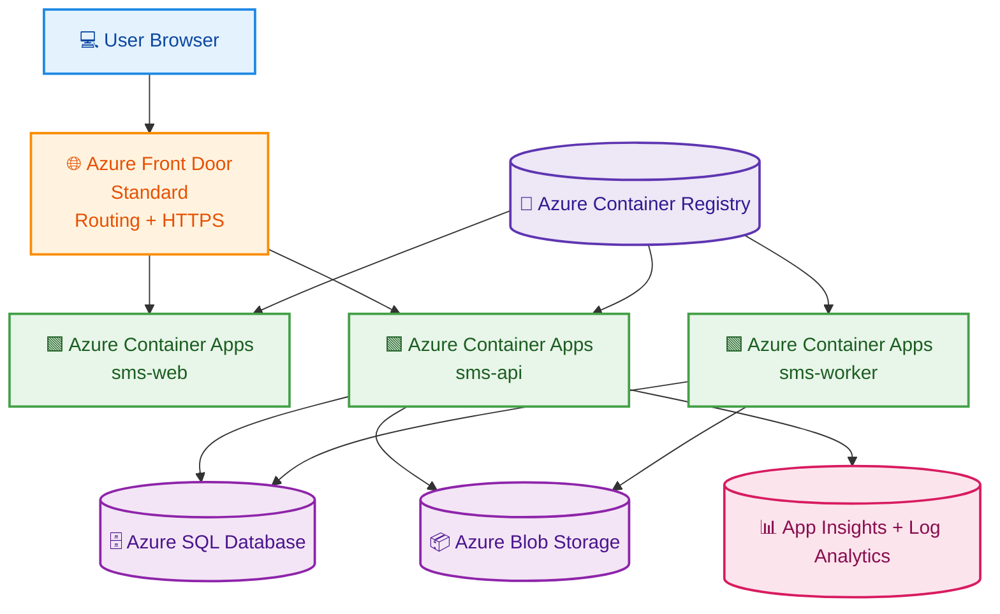

# High-Level Design (HLD)

## Purpose

This document describes the School Management System at a high level for:
- stakeholders,
- reviewers,
- architects,
- non-technical readers.

It explains **what the system is**, **how it is structured**, and **which Azure services support it**.

---

## Solution Summary

The School Management System is a cloud-native application hosted on Microsoft Azure.  
It is composed of:
- a **web frontend** for user interaction,
- an **API backend** for business logic and authentication,
- an optional **background worker** for asynchronous processing.

The platform is deployed using:
- **Terraform** for infrastructure,
- **Azure Container Registry** for container images,
- **Azure Container Apps** for runtime hosting.

Users access the system through **Azure Front Door**, which routes requests to either the web app or the API.

---

## HLD Diagram

---

## Major Components

### 1. User Access Layer
Users access the platform through a browser.

### 2. Edge Layer
**Azure Front Door Standard** acts as the public entry point and provides:
- secure HTTPS access,
- request routing,
- centralized public endpoint.

### 3. Application Layer
The application layer contains:
- `sms-web` → frontend UI,
- `sms-api` → backend business logic and authentication,
- `sms-worker` → optional background processing.

### 4. Data Layer
The data layer contains:
- **Azure SQL Database** for structured transactional data,
- **Azure Blob Storage** for files and documents.

### 5. Monitoring Layer
**Application Insights** and **Log Analytics** collect:
- logs,
- telemetry,
- diagnostics,
- health signals.

### 6. Delivery Layer
**Azure Container Registry** stores the container images used by the application runtime.

---

## Business Benefits of This Design

- Clear separation between UI, logic, and background processing
- Cloud-native deployment model
- Low operational overhead
- Easy to demonstrate and maintain
- Good foundation for future production hardening

---

## HLD Assumptions

- The project runs in a demo/test Azure subscription.
- Entra ID is not available, so authentication uses custom JWT.
- The worker is optional in the current MVP.
- The architecture prioritizes simplicity and portability over advanced enterprise controls.
