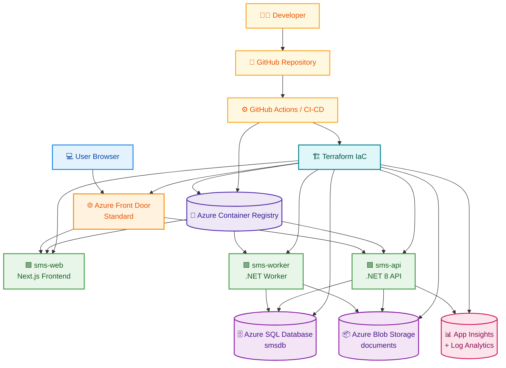

# Low-Level Design (LLD)

## Purpose

This document describes the technical implementation details of the School Management System.

It is intended for:
- developers,
- DevOps engineers,
- reviewers,
- maintainers.

---

## Component Breakdown

## 1. Web Application (`sms-web`)
### Technology
- Next.js
- TypeScript
- Tailwind CSS

### Responsibilities
- login page
- dashboard rendering
- module UI
- browser-side API calls
- token storage in local storage

### Runtime
- Azure Container Apps
- Port 3000

---

## 2. API Application (`sms-api`)
### Technology
- .NET 8 Web API
- Entity Framework Core
- SQL Server provider
- JWT authentication

### Responsibilities
- login and token generation
- business logic
- CRUD APIs
- role-based authorization
- SQL access
- Blob storage integration
- health endpoint

### Runtime
- Azure Container Apps
- Port 8080

---

## 3. Worker Application (`sms-worker`)
### Technology
- .NET Worker Service

### Responsibilities
- current: heartbeat / background scaffold
- future:
  - scheduled jobs
  - reminders
  - notifications
  - report generation
  - document processing

### Runtime
- Azure Container Apps

---

## 4. Database
### Service
- Azure SQL Database

### Stores
- users
- students
- teachers
- classrooms
- attendance sessions
- attendance records
- grades
- fee payments
- announcements

---

## 5. Storage
### Service
- Azure Blob Storage

### Stores
- uploaded documents
- future profile images
- future generated reports

---

## 6. Monitoring
### Services
- Application Insights
- Log Analytics Workspace

### Usage
- request telemetry
- error tracking
- application logs
- operational diagnostics

---

## 7. Delivery & Runtime
### Services
- Azure Container Registry
- Azure Container Apps
- Azure Front Door

---

## LLD Diagram – Runtime View

---

## Runtime Configuration

### API Environment Variables
- `ConnectionStrings__DefaultConnection`
- `JwtSettings__Secret`
- `JwtSettings__Issuer`
- `JwtSettings__Audience`
- `JwtSettings__ExpiryMinutes`
- `BlobStorage__ConnectionString`
- `BlobStorage__ContainerName`

### Web Environment Variables
- `NEXT_PUBLIC_API_URL`

---

## Technical Notes

### Authentication
- API validates credentials and issues JWT
- frontend stores token in local storage
- subsequent API calls include bearer token

### Schema Initialization
The current demo implementation may use `EnsureCreated()` for simplified schema creation.

### Delete Behavior
Relationships are configured with restricted delete behavior to avoid SQL multiple cascade path issues.

---

## LLD Risks / Trade-offs
- custom JWT instead of enterprise SSO
- worker is currently underutilized
- startup DB initialization is demo-oriented
- no private networking in current version
